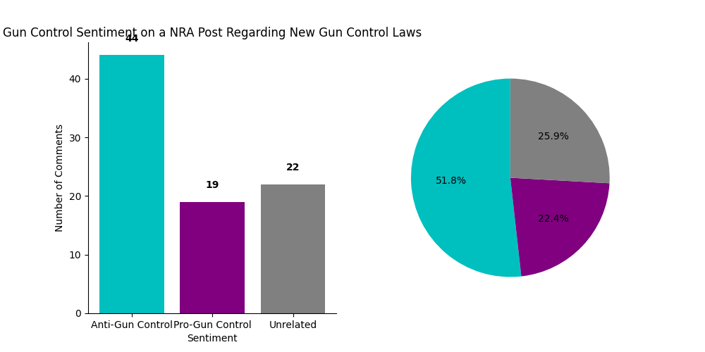
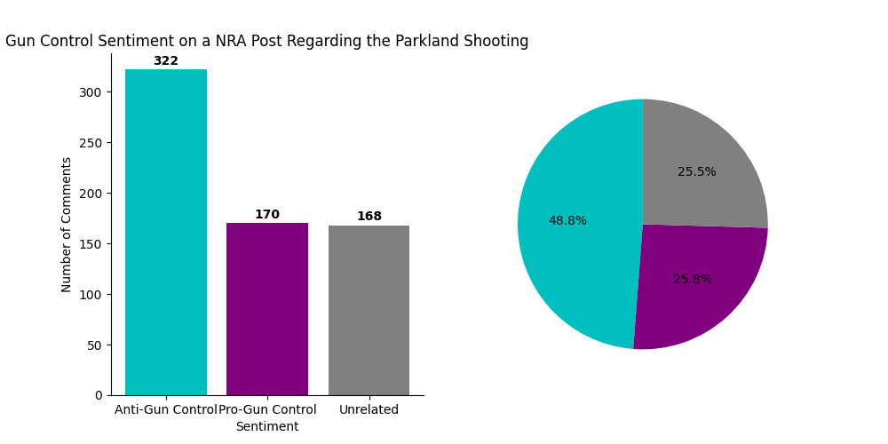

# Social Media Gun Control Sentiment Analysis Project

## Introduction

This project aims to analyze the sentiments shared on social media platforms regarding the topic of gun control. Using natural language processing (NLP) techniques, it aims to understand public opinions, emotions, and attitudes that are part of the discussions about gun control.

## Table of Contents

- [Social Media Gun Control Sentiment Analysis Project](#social-media-gun-control-sentiment-analysis-project)
  - [Introduction](#introduction)
  - [Table of Contents](#table-of-contents)
  - [Project Overview](#project-overview)
  - [Key Features](#key-features)
  - [Data Collection/Preprocessing](#data-collectionpreprocessing)
  - [Sentiment Analysis](#sentiment-analysis)
  - [Findings and Visualizations](#findings-and-visualizations)
  - [License](#license)

## Project Overview

As a prominent socio-political topic, gun control frequently ignites debates between the opposing sides. This project aims to use sentiment analysis methods to understand the general opinions surrounding discussions about gun control. The main goal is to provide valuable insights relevant to creating public policies, conducting media analysis, and raising societal awareness.

## Key Features

- **Data Collection/Processing:** This project utilizes a data-scraper to gain access to social media post and comment data (specifically, Facebook data is collected in this project). This data is not included in this repository. The data is then preprocessed and cleaned to prepare it for sentiment analysis.
- **Sentiment Analysis:** This project integrates NLP techniques to categorize social media content into distinct sentiment classes: Pro-Gun Control, Anti-Gun Control, or Irrelevant.
- **Data Visualization:** This project uses matplotlib to create visualizations that depict the distribution of sentiments.

## Data Collection/Preprocessing

As previously stated, data is scraped from Facebook. The project initially intended to use Twitter, but no cost-effective solution was available after the recent Twitter policy and read-limit changes. The data is scraped using the [facebook-scraper](https://github.com/kevinzg/facebook-scraper) library. Training data was collected from a variety of different posts from selected accounts. The data points were labeled as either Pro-Gun Control, Anti-Gun Control, or Irrelevant (based on the account it was collected from i.e. MomsDemandAction --> Pro-Gun Control). The data was then preprocessed and cleaned to prepare it for sentiment analysis. The preprocessing steps include:
- Removing emojis
- Removing URLs
- Correction of common errors (&amp --> &)
- Removal of extra whitespace
- Removal of paragraph spacing

## Sentiment Analysis

Multiple different methods/models were considered to perform the sentiment analysis. After testing and review, the chosen model was RoBerta with a one-layer feed-forward classifier.

## Findings and Visualizations

The comments inferenced were from two different NRA posts. The results are shown below.

The data above shows a strong anti-gun control sentiment in the comments of NRA posts. This is not entirely surprising as the NRA could be classified as mostly against new gun control laws. 

## License

This project operates under the aegis of the [MIT License](LICENSE).
